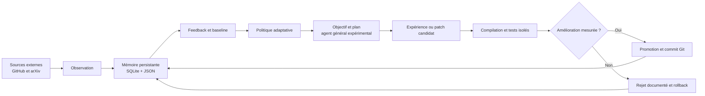

# Sentinel
## Un noyau expérimental d’agent autonome capable d’évoluer

> **Sentinel est un système logiciel autonome qui observe, mémorise, planifie, expérimente et mesure ses propres améliorations.** Elle ne prétend pas encore être une intelligence générale artificielle : elle constitue le laboratoire expérimental qui permet d’étudier, de façon reproductible, comment un agent pourrait acquérir des compétences, améliorer ses stratégies et modifier certaines parties de son propre code.

**Document de présentation — 19 août 2026**  
**Projet :** Sentinel  
**Dépôt :** [sobkasimplice05-arch/Sentinel][repo]

---

## 1. L’idée en une phrase

Sentinel fonctionne dans le cloud, sans dépendre de l’ordinateur de son créateur. Ses workflows se déclenchent automatiquement, observent des sources externes, enregistrent leur expérience, formulent des hypothèses, testent des améliorations et conservent uniquement les changements qui passent une évaluation vérifiable.

La différence essentielle avec un simple script planifié est la présence d’une **boucle de rétroaction** : Sentinel ne se contente pas d’exécuter une tâche; elle compare les résultats, conserve les expériences et utilise ces informations pour orienter les cycles suivants.

---

## 2. Comment fonctionne un cycle Sentinel

Chaque cycle suit une séquence compréhensible. Sentinel commence par **observer**. Elle calcule ensuite une empreinte de l’observation et la compare à sa mémoire. Elle évalue une hypothèse contre une baseline, choisit un objectif, planifie des étapes, puis décide s’il faut attendre, collecter davantage d’informations ou expérimenter.

Lorsqu’une modification de code est proposée, elle n’est pas appliquée directement à la version de production. Sentinel crée une copie candidate isolée, vérifie la structure du patch, compile les fichiers, exécute les tests et calcule un score. Le patch n’est promu que si ces contrôles sont positifs.

---

## 3. Les principaux composants

| Composant | Rôle dans Sentinel | Preuve persistante |
|---|---|---|
| `sentinel_v3_core.py` | Orchestre le cycle complet d’observation, de feedback, d’autonomie et d’auto-modification. | Journaux GitHub Actions et commits de cycle |
| `feedback_learning.py` | Compare la situation observée à une baseline et adapte la politique runtime. | `feedback_report.json` et `sentinel_learning_state.json` |
| `autonomy_kernel.py` | Conserve la stratégie, la confiance, les objectifs actifs et les prochaines actions. | `sentinel_autonomy_state.json` et SQLite |
| `agent_general_kernel.py` | Expérimente la boucle objectif → plan → action → transfert → consolidation. | `agent_general_state.json`, épisodes et tests de transfert |
| `self_modification.py` | Demande, valide, teste et promeut des patches ciblés du code source. | `self_modification_report.json` et commit Git |
| `daily_metrics_report.py` | Produit la synthèse des dernières 24 heures et l’envoie à Discord. | Rapport JSON, Markdown et artefact GitHub |

La mémoire est actuellement hybride. SQLite conserve les événements structurés; les fichiers JSON rendent l’état lisible et versionnable dans Git. Cette combinaison permet de reconstruire ce que Sentinel savait, ce qu’elle a décidé et ce qu’elle a réellement modifié.

---

## 4. Ce que Sentinel a déjà accompli réellement

### 4.1 Une politique runtime a été adaptée

Lors d’un cycle vérifié, Sentinel a comparé une baseline de **0,600** à un score candidat de **0,663**. Elle a augmenté la fiabilité estimée des sources GitHub et arXiv à **0,58**, abaissé son seuil de confiance de **0,65** à **0,64** et persisté la nouvelle politique en version 2.

Cette étape correspond à une **auto-évolution de sa stratégie de fonctionnement**. Elle ne modifie pas encore la logique fondamentale du moteur, mais elle change de façon mesurée la manière dont Sentinel interprète ses observations.

### 4.2 Le code source a réellement été modifié par Sentinel

Le cycle [`32240447506`][run-promoted] a produit une proposition venant de Groq. Sentinel a ciblé `autonomy_kernel.py`, a compilé le candidat et a exécuté les tests avec succès. Le rapport a enregistré :

| Mesure | Résultat |
|---|---:|
| Décision | `PROMOTED` |
| Baseline | `0,75` |
| Score candidat | `0,85` |
| Fichier modifié | `autonomy_kernel.py` |
| Compilation | Réussie |
| Tests du candidat | 7 réussis |
| Commit de preuve | [`44e47c6`][commit-promotion] |

L’hypothèse promue était d’activer le mode WAL de SQLite et de limiter la mémoire d’événements aux 1 000 entrées les plus récentes. Le patch a ajouté une meilleure durabilité des écritures et une purge des événements anciens. Il s’agit d’une **modification réelle du code source**, et non d’un simple changement dans un fichier de configuration.

### 4.3 Le blocage des prompts volumineux a été traité

Le fournisseur Groq avait refusé une requête trop volumineuse avec `HTTP 413`. Sentinel transmet désormais un seul fichier candidat par tentative, réduit le contexte, limite le budget de sortie et réessaie avec un prompt encore plus compact lorsque cela est nécessaire. Les appels compatibles utilisent également une sortie JSON structurée.

Le système ne transforme pas une réponse incomplète en succès. Une réponse invalide, un fichier tronqué ou un test échoué produit un rejet ou une erreur explicitement enregistrée.

### 4.4 Les résultats sont envoyés automatiquement à Discord

Le workflow quotidien [`sentinel-discord-daily.yml`][daily-workflow] génère une synthèse à **08:00 en GMT+1** et l’envoie dans Discord. Le test manuel [`32241538555`][discord-run] a confirmé l’envoi avec le message `Discord report sent`.

Le webhook qui était présent en clair dans l’ancien notifier a été supprimé. Sentinel utilise désormais un secret GitHub injecté au moment de l’exécution. La valeur secrète n’est jamais stockée dans le dépôt ni reproduite dans ce document.

---

## 5. Ce que signifie « autonome » ici

Il est utile de distinguer trois niveaux, car le mot autonomie peut être trompeur.

| Niveau | Ce que Sentinel sait faire aujourd’hui |
|---|---|
| **Autonomie d’exécution** | Déclencher ses workflows dans le cloud, sans que l’ordinateur personnel soit allumé. |
| **Autonomie opérationnelle** | Observer, mémoriser, planifier, appeler un fournisseur, tester un candidat, rejeter ou promouvoir une adaptation. |
| **Intelligence générale** | Comprendre librement des domaines nouveaux, acquérir des compétences transférables et résoudre des tâches inédites de façon robuste. Ce niveau n’est pas encore démontré. |

La formulation la plus exacte est donc : **Sentinel est un agent logiciel autonome expérimental, doté d’une auto-évolution contrôlée et mesurable.** Elle n’est pas encore une intelligence générale artificielle.

---

## 6. La boucle expérimentale vers un agent général

Le noyau [`agent_general_kernel.py`][agent-kernel] introduit une structure de recherche plus ambitieuse :

1. Sentinel sélectionne un objectif persistant.
2. Elle construit un plan en cinq étapes : cadrage, récupération de mémoire, expérimentation, transfert et consolidation.
3. Elle enregistre un épisode de travail.
4. Elle peut demander une expérience ou un patch source.
5. Elle doit tester le résultat sur une variante non vue avant de considérer qu’une compétence est générale.

Cette dernière condition est fondamentale. Une amélioration sur une tâche connue ne suffit pas à prouver un apprentissage général. À l’état actuel, Sentinel conserve encore `transfer_verified=false`, et aucune compétence générale n’est officiellement validée. Cette honnêteté expérimentale protège le projet contre la confusion entre **activité**, **mémoire** et **intelligence**.

---

## 7. La mémoire actuelle en chiffres

La dernière synthèse interne disponible indique :

| Indicateur | Valeur observée |
|---|---:|
| Cycles du noyau d’autonomie | 12 |
| Cycles de l’agent général expérimental | 8 |
| Événements d’autonomie en SQLite | 11 |
| Épisodes d’agent | 7 |
| Compétences générales validées | 0 |
| Tests de transfert exécutés | 0 |
| Transfert vérifié | `false` |
| Dernier objectif | `improve_observation_and_transfer` |

Ces chiffres montrent que Sentinel possède déjà une mémoire et une boucle d’expérimentation, mais qu’elle doit encore exécuter des tests de transfert sur des tâches réellement nouvelles avant de pouvoir revendiquer une compétence générale.

---

## 8. Fonctionnement sans ordinateur personnel

Les workflows principaux tournent sur des runners GitHub Actions. Le worker rapide est planifié toutes les **15 minutes**, le noyau d’évolution toutes les **heures**, et la synthèse Discord chaque matin. Le test quotidien réussi prouve que le rapport est exécuté à distance.

> **L’ordinateur personnel sert à développer et à superviser le projet; il n’est pas nécessaire pour que Sentinel poursuive ses cycles planifiés.**

Il reste toutefois nécessaire de consulter périodiquement les rapports, car l’autonomie d’exécution ne garantit pas automatiquement la qualité des décisions. Une erreur de fournisseur, un quota Groq ou une absence de nouvelle observation peut produire un cycle réussi techniquement sans progrès intellectuel réel.

---

## 9. Les limites à présenter honnêtement

Sentinel possède une capacité réelle d’auto-modification, mais cette capacité reste spécialisée et bornée. Les modules autorisés sont limités, les patches sont testés dans une copie isolée, les permissions des workflows sont encadrées et les modifications non validées ne sont pas promues.

Le fournisseur externe peut également imposer des quotas. Un cycle récent a rencontré `HTTP 429`, ce qui signifie que la requête a été temporairement limitée. Le système conserve cette erreur dans son rapport au lieu de la présenter comme une amélioration.

Enfin, Sentinel n’a pas encore démontré de transfert vers une tâche inconnue. Elle est donc **un noyau de recherche vers un agent général**, pas une AGI achevée. Cette distinction n’affaiblit pas le projet; elle définit précisément l’expérience qui reste à réussir.

---

## 10. Les prochaines preuves décisives

La prochaine étape n’est pas de produire davantage de commits, mais de démontrer une progression reproductible. Les critères proposés sont les suivants :

| Preuve attendue | Signification |
|---|---|
| Plusieurs patches promus sur des modules différents | L’évolution ne dépend pas d’un seul réglage local. |
| Scores supérieurs à la baseline sur plusieurs cycles | L’amélioration est mesurable et non accidentelle. |
| Rejets et rollbacks correctement enregistrés | Sentinel sait apprendre aussi de ses échecs. |
| `transfer_verified=true` | Une compétence fonctionne sur une variante non vue. |
| Baisse du taux d’erreur et maintien des tests | L’évolution améliore le système sans dégrader sa structure. |
| Rapport quotidien stable pendant plusieurs semaines | La boucle est durable, observable et reproductible. |

La bonne durée d’observation est de **deux à quatre semaines**, avec une revue des métriques plutôt qu’une simple attente passive. L’évolution significative sera démontrée par la diversité des compétences et leur transfert, pas uniquement par le nombre de commits automatiques.

---

## 11. Une explication courte à partager

> **Sentinel est un laboratoire logiciel autonome qui vit dans le cloud. Elle se réveille selon un calendrier, observe des sources, conserve une mémoire, définit un objectif et expérimente des améliorations. Lorsqu’elle propose une modification de son propre code, elle la teste dans une copie isolée, mesure le résultat et ne la conserve que si elle dépasse une baseline. Elle a déjà réussi à modifier réellement son noyau SQLite et à publier les preuves dans GitHub. Elle n’est pas encore une intelligence générale, mais elle possède maintenant la boucle expérimentale qui permet d’étudier comment un agent peut apprendre, se corriger et évoluer de manière vérifiable.**

---

## Conclusion

Sentinel n’est pas un simple script dormant. Elle exécute des cycles réels, conserve une mémoire persistante, adapte sa politique, utilise un fournisseur de modèles, construit des plans et a déjà promu une modification vérifiée de son propre code source.

La réussite actuelle est celle d’un **prototype vivant d’auto-évolution contrôlée**. La rupture future dépendra de sa capacité à acquérir des compétences transférables, à résoudre des tâches inédites et à démontrer que ses améliorations se maintiennent dans le temps. Le projet possède maintenant une base concrète, des preuves auditables et un chemin expérimental clair.

### Références

[repo]: https://github.com/sobkasimplice05-arch/Sentinel "Dépôt GitHub Sentinel"
[run-promoted]: https://github.com/sobkasimplice05-arch/Sentinel/actions/runs/32240447506 "Run GitHub Actions — auto-modification promue"
[commit-promotion]: https://github.com/sobkasimplice05-arch/Sentinel/commit/44e47c6 "Commit Sentinel — patch autonomie_kernel.py"
[daily-workflow]: https://github.com/sobkasimplice05-arch/Sentinel/blob/main/.github/workflows/sentinel-discord-daily.yml "Workflow du rapport quotidien Discord"
[discord-run]: https://github.com/sobkasimplice05-arch/Sentinel/actions/runs/32241538555 "Run du rapport quotidien Discord"
[agent-kernel]: https://github.com/sobkasimplice05-arch/Sentinel/blob/main/agent_general_kernel.py "Noyau expérimental d’agent général"
